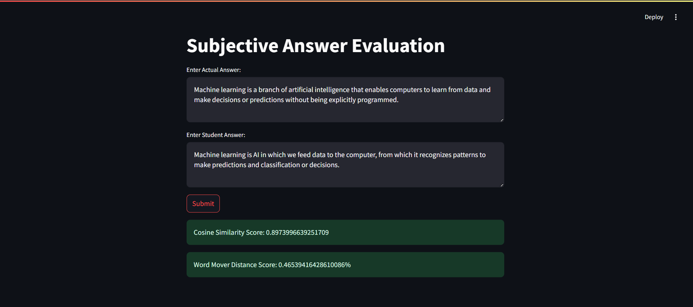

# Gradely - Subjective Answer Evaluation Tool

• An AI-powered tool for evaluating students’ subjective answers.
• Aims to reduce the burden on teachers by automating and removing biases in evaluation.
• Implementation of BERT for word embedding, Cosine Similarity, and Word Mover’s Distance to
evaluate the semantic similarity between students’ answers and the correct answer.

---

## 🖥️ Live Demo

🌐 [https://gradely.streamlit.app](https://gradely.streamlit.app/)

---

## 📸 Screenshots

